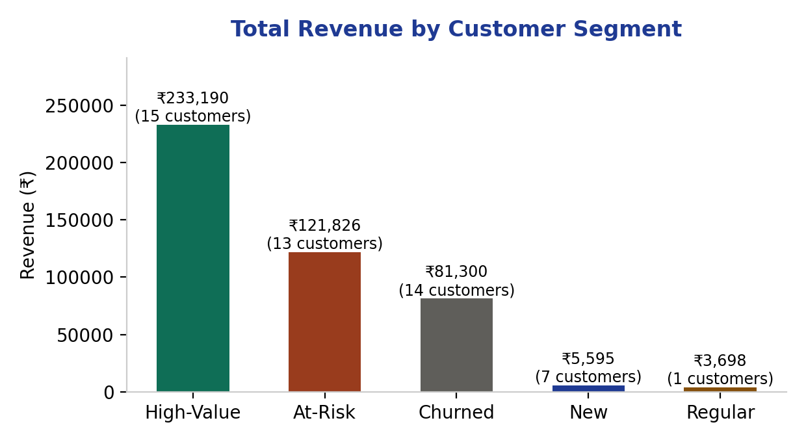

# Customer Segmentation & Churn Analysis (SQL)
### ShopSphere — an SQL-based RFM segmentation and retention analysis



`#sql` `#customer-segmentation` `#churn-analysis` `#rfm` `#data-analysis` `#case-study`

---

## The Question

Which customers should ShopSphere prioritize keeping happy, which ones are slipping away, and which ones need a win-back campaign — using only order history, no guessing?

## The Approach: RFM Segmentation

Every customer is scored on three signals pulled straight from the `orders` table:

- **Recency** — days since their last order
- **Frequency** — how many orders they've placed, ever
- **Monetary** — total amount spent, all-time

These three signals are combined with a `CASE WHEN` rule set into five segments:

| Segment | Rule | What it means |
|---|---|---|
| **High-Value** | 3+ orders, last order within 30 days | Best customers — active and frequent |
| **At-Risk** | Ordered before, but nothing in 31–90 days | Used to buy often, going quiet — win-back priority |
| **Churned** | No order in 90+ days | Effectively lost |
| **New** | Signed up in last 30 days, 0–1 orders | Too early to judge — nurture, don't discount yet |
| **Regular** | Everyone else | Occasional, steady buyers |

## The Result

| Segment | Customers | Total Revenue |
|---|---|---|
| High-Value | 15 | ₹2,33,190 |
| At-Risk | 13 | ₹1,21,826 |
| Churned | 14 | ₹81,300 |
| New | 7 | ₹5,595 |
| Regular | 1 | ₹3,698 |

**Repeat purchase rate: 80%** — 4 out of every 5 customers have ordered more than once, meaning most of the revenue is retention-driven, not one-time sales.

## Why This Matters

The **At-Risk segment (₹1.2L in past spend)** is the single most actionable finding here — these are customers who already proved they'll buy repeatedly, but have gone quiet in the last 1–3 months. A targeted win-back email sequence (see my [CRM Lead Nurture project](../CRM-Lead-Nurture-SkillBridge) for exactly this kind of flow) is far cheaper than acquiring a new customer to replace that revenue.

## SQL Concepts Used

- **CTEs / Views** — building a reusable `customer_rfm` base before segmenting
- **CASE WHEN** — rule-based classification (SQL's equivalent of Excel's `IF`)
- **JOIN** — combining `orders` and `products` for category-level revenue
- **GROUP BY + aggregate functions** (`SUM`, `COUNT`, `AVG`) — rolling up order-level data to customer- and segment-level summaries
- **Date arithmetic** (`julianday()`) — calculating recency in days

## Files in this repo

```
README.md
schema.sql       -- table structure (customers, products, orders)
queries.sql      -- all 7 analysis queries, commented step by step
shopsphere.db    -- ready-to-run SQLite database with sample data
assets/
  chart-segment-revenue.png
```

## How to run it

```bash
sqlite3 shopsphere.db
.read queries.sql
```
Or open `shopsphere.db` in any SQLite viewer (e.g., DB Browser for SQLite) and run `queries.sql` directly.

## Note

Dataset (50 customers, 15 products, ~190 orders) is simulated for portfolio purposes, built with a deliberate mix of segment types to make the analysis meaningful.
